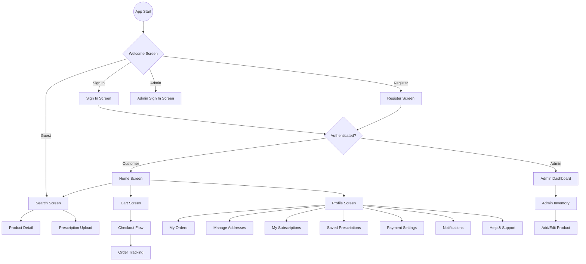

# Saraswati Medical App Navigation Tree

This document illustrates the navigation structure of the application for both Customers and Admins.

## App Flow Overview

## Key Navigation Nodes

| Screen | Primary Access Point | Sub-sections / Actions |
| :--- | :--- | :--- |
| **Home** | Tab Bar (Bottom) | Category browsing, Search entry, Quick access |
| **Search** | Tab Bar / Home Header | Product filtering, Prescription upload FAB |
| **Cart** | Tab Bar | Checkout flow, Quantity management |
| **Profile** | Tab Bar | User settings, Order history, Addresses |
| **Admin Dashboard**| Admin Auth Success | Stats, Inventory management |

## Navigation Logic
- **Authenticated Stacks**: The app switches between `Customer` and `Admin` stacks based on the user's role stored in Firestore.
- **Guest Access**: Users can access the **Search** screen directly from the Welcome screen to browse products before signing in.
- **Failsafe**: All stacks include the `Welcome` screen as a fallback to handle logout transitions gracefully.
